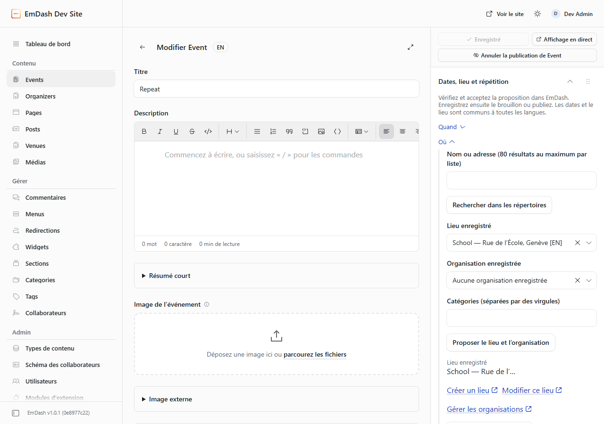

<p align="center">
  
</p>

# Eventual

<p align="center">
  <a href="https://github.com/Vermeulen-Solutions/eventual-emdash-sandbox/actions/workflows/ci.yml"></a>
  <a href="https://github.com/Vermeulen-Solutions/eventual-emdash-sandbox/releases"></a>
  <a href="https://plugins.emdashcms.com/plugins/@vermeulen.solutions/eventual"></a>
  <a href="https://emdashcms.com"></a>
  <a href="./LICENSE"></a>
  
  
</p>

A modern, sandboxed event management plugin for [EmDash CMS](https://emdashcms.com).

Whether you run community meetups, webinars, conferences, workshops, or recurring club gatherings, **Eventual** makes it easy for editors to manage schedules, venues, and organizers in EmDash, while offering fast, accessible public event feeds and calendar views for your website visitors.

Starting with **v0.12.0**, Eventual natively integrates with **EmDash collections**, bringing full row-per-locale translations, native drafts, revisions, scheduled publishing, and Portable Text descriptions.

---

## At a Glance

- **Native Multilingual Collections:** Leverages EmDash core collections (`events`, `venues` or `locations`) with row-per-locale translation siblings and automatic synchronization of invariant schedule fields across languages.
- **Designed for Content Editors:** Native collection editing with Portable Text rich text descriptions, schedule validation, physical, virtual, or hybrid attendance, and a dedicated companion dashboard.
- **Visual & Accessible Public Views:** An included [Astro frontend example](./examples/astro-events/README.md) offers seven responsive, zero-JavaScript visitor views: card grid, compact list, timeline, daily schedule, date strip, month calendar, and location groupings.
- **One-Click Calendar Sync:** Built-in public iCalendar (`webcal`) subscription and downloadable `.ics` files with RFC 5545 monotonic `SEQUENCE` tracking, inclusive-to-exclusive all-day date conversion, and cancellation tombstones.
- **Resumable Migration Engine:** Non-destructive `migrateToNative` MCP tool and endpoint to migrate existing events from legacy storage with dry-run previews and idempotency guarantees.
- **AI & Automation Access:** Eventual MCP tools inspect native events and support legacy migration. Use EmDash core content tools for native writes and publication.
- **Sandboxed & Private:** Runs inside EmDash's security sandbox with dedicated storage, strict permissions, and zero unauthorized outbound network requests.

> **Supported editor host (0.12.1):** EmDash, Admin and Block Kit **1.0.1**, Astro **7.3.x** (at least 7.3.2), Vite **8.3.x**, React **19**, and Node **24+**. Other host versions require compatibility verification. Install both the registry backend and the matching host package.

---

## Visual Tour

### 1. Beautiful Public Visitor Calendar
Render public events on your site using the included Astro showcase with seven responsive layouts, month navigation, and category filtering—with zero client-side JavaScript.

<p align="center">
  
</p>

---

### 2. Event Details & One-Click Calendar Sync
Visitors can view full event details, join virtual meetings, get venue directions, and add events to Google Calendar, Outlook, Yahoo, or Apple Calendar.

<p align="center">
  
</p>

---

### 3. Events Management Dashboard
Browse and manage your events with status filtering, date indicators, and quick links directly to EmDash's native collection editor.

<p align="center">
  
</p>

---

### 4. Saved Organizers & Venues
Maintain a directory of organizers (names, websites, contact links) and physical venues with structured addresses and map directions.

Venue choices combine translation siblings into one selection, show the name and address, and retain the saved native ID. Search finds names or addresses, including accents; draft venues are marked and must be published before their events. Create and edit links open the native venue editor.

---

## Key Features

### For Content Editors & Site Managers
- **Native EmDash Collections:** Edit events and venues directly in EmDash's core editor with native revisions, draft states, and scheduled publication.
- **Row-per-locale Translations:** Localize event titles, Portable Text descriptions, excerpts, and occurrence notes independently per language.
- **Invariant Schedule Sync:** Core shares committed dates, venues and recurrence across published translation siblings; pending drafts remain separate from live content.
- **One-off & Recurring Events:** Support for daily, weekly (with specific weekday selection), and monthly recurrence intervals configured through the native Recurrence & Schedule editor panel.
- **Manage Occurrence Dates:** Visual 90-day inspection with cancellation, restoration, rescheduling and per-language announcements. Changes pass through EmDash's draft review and publication controls.
- **Physical, Virtual & Hybrid:** Specify in-person locations, video conference links (Zoom, Google Meet, YouTube Live), or both.
- **Media Library Integration:** Pick event covers directly from the EmDash media library or supply external image URLs.
- **Companion Workspace & Dashboard Widget:** Browse native events with schedule summaries, status badges, and safe duplication at `/events`, and highlight upcoming published events on the EmDash admin dashboard.

### For Developers & Site Builders
- **Multilingual Public JSON API:** High-performance feed at `/_emdash/api/plugins/eventual/publicEvents` with date range, locale, strict mode, and category filtering.
- **Live iCalendar (`webcal`) Feed:** RFC 5545 compliant subscription route at `/_emdash/api/plugins/eventual/calendar` with monotonic integer `SEQUENCE` values and 366-day cancellation tombstones.
- **Schema.org Structured Data:** Built-in JSON-LD generators (`eventToJsonLd`, `serializeJsonLd`) for rich search engine indexing.
- **Portable Astro Feed Client:** Import `eventual/astro` in your Astro project to query the feed and render the unstyled `EventList.astro` component or full custom interfaces.
- **Resumable Migration Engine:** Automated `migrateToNative` engine reads legacy plugin tables and writes native collections in safe, previewable batches with ledger mapping.

---

## Installation & Setup

### 1. Install via EmDash Plugin Registry
Install Eventual **0.12.1** through EmDash's registry administration. The plugin publisher CLI does not have an `install` command. The original 0.12.0 release is superseded by this recovery release.

For friendly editing, install the matching host tarball and use `eventual/install` for the EmDash integration. It registers the frontend companion and the tested compatibility adapter together. See the [installation and upgrade runbook](./docs/editor-upgrade.md). Registry installation alone does not install frontend widgets or upgrade existing schemas. Public-page screenshots show the earlier Astro showcase; the editor screenshot is from the current release acceptance test.

### 2. Apply Collection Blueprints
Eventual exports typed collection blueprints to seed the required EmDash collections:

```ts
import {
  createEventsCollectionBlueprint,
  createVenuesCollectionBlueprint,
} from 'eventual/schema';

// Creates the "events" collection schema
const eventsCollection = createEventsCollectionBlueprint({
  venueCollection: 'venues', // or "locations"
});

// Creates the "venues" collection schema
const venuesCollection = createVenuesCollectionBlueprint();
```

See [Registry Installation Guide](./docs/registry-installation.md) for full instructions.

### 3. Permissions
Eventual requests minimal capabilities within the EmDash sandbox:
- `content:read`, `content:write`, `content:publish`, `content:revisions:read`: For native event management, publication, and migration.
- `schema:read`: To detect active collection schemas.
- `hooks.content-policy:register`: To validate schedules, preserve domain history and protect dependencies; core performs shared-field synchronization.
- `admin.editor-draft:read`, `admin.editor-draft:patch`: To inspect permitted draft fields and propose changes through the host's review mechanism.
- `media:read`, `media:bytes:read`: To display and serve selected event cover images.
- `allowedHosts: []`: **Zero outbound HTTP requests**; all data stays strictly within your site.

Editors with `content:edit_any` can access the companion dashboard; `plugins:manage` is required for migration and MCP tools.

---

## Visitor Pages (Astro Frontend)

Eventual is a backend and API companion: it manages event data and serves public JSON/iCal feeds, leaving the presentation layer entirely up to your website.

To make building visitor pages easy, an official, runnable showcase is included in [`examples/astro-events/`](./examples/astro-events/README.md).

### Quick Start with the Astro Client
In your Astro project, install the plugin package:

```sh
npm install https://github.com/Vermeulen-Solutions/eventual-emdash-sandbox/releases/download/v0.12.1/eventual-0.12.1.tgz
```

Then query the public feed in your Astro pages:

```astro
---
// src/pages/events.astro
import { fetchPublicFeed } from "eventual/astro";
import EventList from "eventual/astro/EventList.astro";

const apiOrigin = "http://localhost:4321"; // Your EmDash site URL
const from = "2026-11-01";
const through = "2026-11-30";

const { events } = await fetchPublicFeed(
  apiOrigin,
  from,
  through,
  undefined,
  { locale: "fr", strict: false }
);
---

<html>
  <head>
    <title>Événements à venir</title>
  </head>
  <body>
    <h1>Événements</h1>
    <EventList events={events} locale="fr" emptyMessage="Aucun événement prévu." />
  </body>
</html>
```

### Included Visitor Views

Visitors can switch between seven viewing formats via query parameter (e.g., `/events?view=calendar`):

| View | Query Param | Description |
| :--- | :--- | :--- |
| **List** *(Default)* | `?view=list` | Chronological agenda list with high-contrast date blocks. |
| **Timeline** | `?view=timeline` | Vertical timeline with visual event nodes and summary cards. |
| **Card Grid** | `?view=cards` | Rich card grid displaying event cover images, organizers, and tags. |
| **Daily Schedule** | `?view=schedule` | Collapsible daily disclosures grouping events per date. |
| **Date Strip** | `?view=dates` | Horizontal date jump bar for quick navigation across the month. |
| **Month Calendar** | `?view=month` | Full week-aligned calendar grid on desktop; day-by-day agenda on mobile. |
| **Locations** | `?view=locations` | Events grouped by physical venue or virtual attendance with map directions. |

---

## Public APIs

### 1. Public Events JSON Route
```http
GET /_emdash/api/plugins/eventual/publicEvents?from=YYYY-MM-DD&through=YYYY-MM-DD&locale=fr&strict=false&category=Music
```

**Parameters:**
- `from` *(string, optional)*: Inclusive start date (`YYYY-MM-DD`). Defaults to today.
- `through` *(string, optional)*: Inclusive end date (`YYYY-MM-DD`). Defaults to 180 days after `from` (max 366 days).
- `locale` *(string, optional)*: Target locale code (e.g. `fr`, `en-US`).
- `strict` *(boolean, optional)*: When `true`, omits events lacking a translation in the requested locale. When `false`, falls back to available sibling with prefix tag (e.g. `[EN]`). Defaults to `false`.
- `category` *(string, optional)*: Case-insensitive category filter.

**Response Structure:**
```json
{
  "success": true,
  "data": {
    "ok": true,
    "from": "2026-11-01",
    "through": "2026-11-30",
    "locale": "fr",
    "events": [
      {
        "id": "event-123",
        "title": "Conférence annuelle",
        "description": [...],
        "start": "2026-11-15T09:00:00.000Z",
        "end": "2026-11-15T17:00:00.000Z",
        "allDay": false,
        "timezone": "Europe/Paris",
        "location": "Salle Principale",
        "locationType": "hybrid",
        "virtualUrl": "https://meet.example.com/conference",
        "status": "published",
        "eventStatus": "scheduled",
        "organizer": "Jane Doe",
        "categories": ["Conferences"],
        "venue": {
          "id": "venue-1",
          "name": "Salle Principale",
          "address": "12 Rue de Rivoli, Paris"
        },
        "directionsUrl": "https://www.google.com/maps/dir/?api=1&destination=Salle+Principale"
      }
    ]
  }
}
```

### 2. Public iCalendar Subscription
```http
GET /_emdash/api/plugins/eventual/calendar?locale=fr&strict=true&category=Music
```
- Raw `text/calendar` feed covering a rolling 365-day window.
- Respects daylight-saving adjustments and custom recurrence rules.
- Emits RFC 5545 compliant monotonic integer `SEQUENCE` values.
- Emits `STATUS:CANCELLED` tombstones when occurrences are cancelled or unpublished, ensuring subscriber calendars automatically remove deleted events.

---

## Migrating from Legacy Storage

Sites upgrading from earlier Eventual releases (`< 0.12.0`) can migrate existing events, venues, and organizers non-destructively:

1. **Dry-Run Preview:** Inspect payloads, counts, and potential warnings with zero database writes:
   ```json
   { "dryRun": true, "limit": 50, "defaultLocale": "en" }
   ```
2. **Batch Execution:** Run migration batches using `limit` and `nextCursor`.
3. **Safety Guarantees:** Legacy records are **never deleted or modified**, unique indexed `legacy_id` tokens prevent duplicate records, and Markdown descriptions are deterministically converted to Portable Text with source strings preserved in `legacy_metadata`.

Run migration via the `migrateToNative` MCP tool or `POST /_emdash/api/plugins/eventual/mcp/transfer/migrateToNative`. See the [Native Modernization Guide](./docs/native-modernization.md) for full instructions.

---

## AI & Agent Access (MCP Tools)

Eventual exposes Model Context Protocol (MCP) tools for AI agents under the `eventual__` namespace:

- **Migration & Transfers:** `migrateToNative`, `exportRecords`, `previewImport`, `importRecords`.
- **Settings:** `getDefaultTimezone`, `updateDefaultTimezone`.
- **Native reads:** `listEvents`, `getEvent`, `listOccurrences`, `listVenues`, `listOrganizers` read the native source. Saved live data is authoritative; inspect pending revisions with core tools.
- **Legacy writes (only without native collections):** `createEvent`, `updateEvent`, `publishEvent`, `unpublishEvent`, `deleteEvent`, `setOccurrenceException`, `removeOccurrenceException`, `createVenue`, `updateVenue`, `deleteVenue`, `createOrganizer`, `updateOrganizer`.

Configure EmDash's MCP access and use an account/token with `plugins:manage` for Eventual tools. The retired Eventual “Agent Access” settings form is not part of the current workspace. Native transfer export is a content inspection format, not a full site/revision backup; native import remains blocked.

---

## Development & Testing

```sh
npm install          # Install dependencies
npm run validate     # Validate plugin manifest and schemas
npm run typecheck    # Run TypeScript compiler checks
npm test             # Run unit & worker integration tests
npm run test:tooling # Run migration, AST, and helper tests
npm run bundle       # Build distribution bundle
npm run budget       # Verify bundle size constraints
npm run test:package # Run integration tests against packed tarball
```

---

## Documentation

- [Native Modernization Guide](./docs/native-modernization.md) — Comprehensive schema, invariant sync, and migration documentation.
- [Registry Installation Guide](./docs/registry-installation.md) — Plugin marketplace installation and initial setup.
- [Registry Changelog](./docs/registry-changelog.md) — Public changelog for registry releases.
- [Release Notes 0.12.1](./docs/release-notes-0.12.1.md) — Recovery release, installation requirements and verification.
- [Astro Visitor Example](./examples/astro-events/README.md) — 7-view zero-JS visitor showcase.

---

## License

Eventual is licensed under the [MIT License](./LICENSE).
