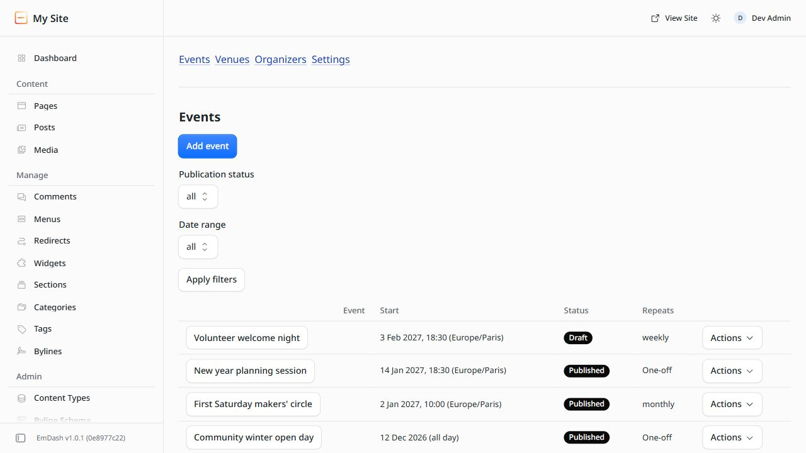
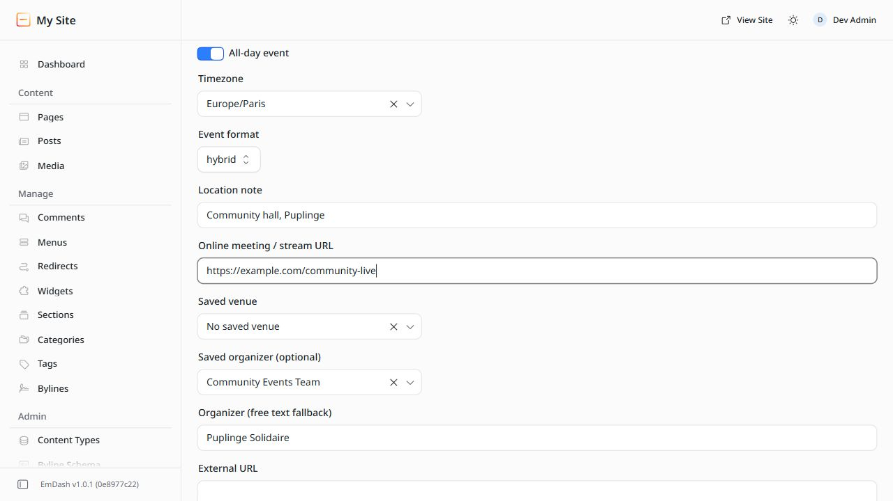
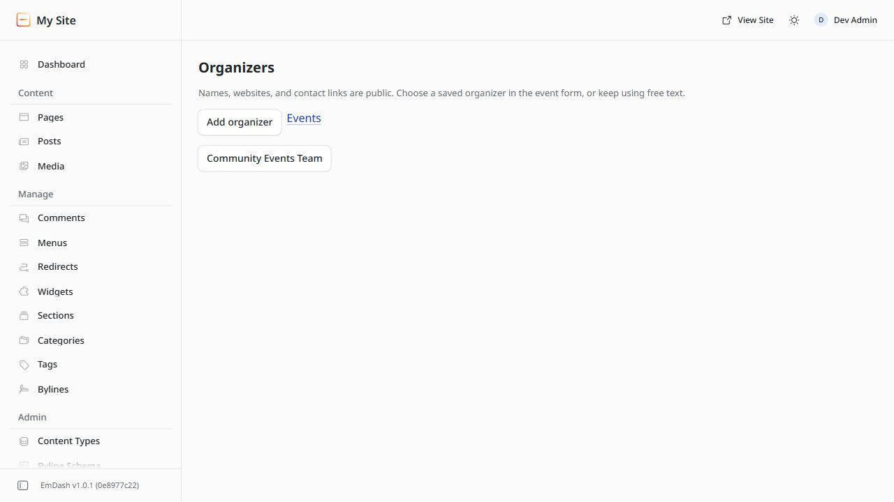
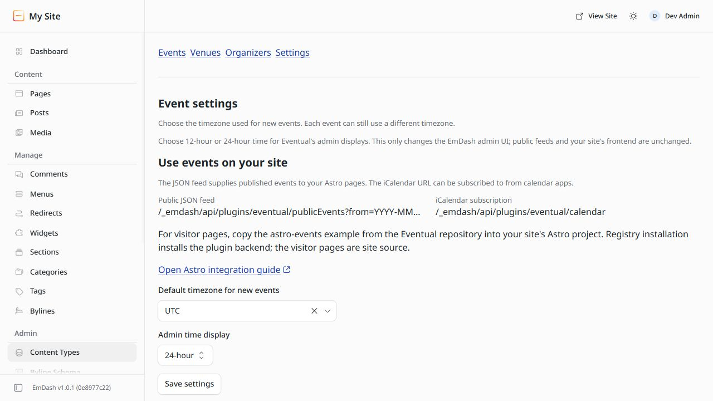

<p align="center">
  
</p>

# Eventual

<p align="center">
  <a href="https://github.com/Vermeulen-Solutions/eventual-emdash-sandbox/actions/workflows/ci.yml"></a>
  <a href="https://github.com/Vermeulen-Solutions/eventual-emdash-sandbox/releases"></a>
  <a href="https://emdashcms.com"></a>
  <a href="./LICENSE"></a>
  
  
</p>

A modern, sandboxed event management plugin for [EmDash CMS](https://emdashcms.com).

Whether you run community meetups, webinars, conferences, workshops, or recurring club gatherings, **Eventual** makes it easy for editors to manage schedules, venues, and organizers in EmDash, while offering fast, accessible public event feeds and calendar views for your website visitors.

---

## At a Glance

- **Designed for Non-Technical Editors:** Intuitive admin forms for scheduling one-off or recurring events, selecting venues, picking organizers, and choosing physical, virtual, or hybrid attendance.
- **Visual & Accessible Public Views:** An included [Astro frontend example](./examples/astro-events/README.md) offers seven responsive, zero-JavaScript visitor views: card grid, compact list, timeline, daily schedule, date strip, month calendar, and location groupings.
- **One-Click Calendar Sync:** Built-in public iCalendar (`webcal`) subscription and downloadable `.ics` files compatible with Apple Calendar, Google Calendar, and Outlook.
- **AI & Automation Ready:** Built-in Model Context Protocol (MCP) tools let authorized AI agents safely manage events, update schedules, and query occurrences.
- **Sandboxed & Private:** Runs inside EmDash's security sandbox with dedicated storage, strict permissions, and zero unauthorized outbound network requests.

> **Requirements:** Eventual `0.11.0` requires **EmDash 1.0.1** or newer.

---

## Visual Tour

### 1. Events Management
Easily browse, filter (by status and upcoming/past dates), duplicate drafts, and manage all your events with paginated tables and confirmed bulk deletion.

<p align="center">
  
</p>

---

### 2. Flexible Event Editor
Create timed or all-day events with automatic timezone normalization, media library image selection, venue assignments, and lightweight Markdown descriptions.

<p align="center">
  
</p>

---

### 3. Saved Organizers & Venues
Maintain a reusable directory of organizers (names, websites, contact links) and physical venues with structured addresses and instant map directions.

<p align="center">
  
</p>

---

### 4. Admin Settings & Feed Access
Customize time display (24-hour or 12-hour AM/PM) and access public JSON and iCalendar feed endpoints directly.

<p align="center">
  
</p>

---

### 5. Beautiful Public Visitor Calendar
Render public events in your site using the included Astro example with 7 responsive layouts, month navigation, and category filtering—with zero client-side JavaScript.

<p align="center">
  
</p>

---

### 6. Event Details & One-Click Calendar Sync
Visitors can view event specifics, join virtual meetings, get venue directions, and add events to Google Calendar, Outlook, Yahoo, or Apple Calendar.

<p align="center">
  
</p>

---

## Key Features

### For Content Editors & Site Managers
- **One-off & Recurring Events:** Support for daily, weekly (with specific weekday selection), and monthly recurrence (up to 52 intervals).
- **Manage Occurrence Dates:** Select *Manage occurrence dates* on any saved recurring event to view a 90-day window and easily cancel, move, or restore specific dates without affecting the rest of the series.
- **Physical, Virtual & Hybrid:** Specify in-person locations, video conference links (Zoom, Google Meet, YouTube Live), or both.
- **EmDash Media Integration:** Pick event covers directly from the EmDash media library (up to 8 MiB) or supply an external image URL.
- **Concurrent Edit Protection:** Admin forms automatically detect if another editor made changes while a form was open, preventing accidental overwrites.
- **Draft Duplication:** Duplicate existing events into unpublished drafts with clean schedules ready for quick adjustments.
- **Dashboard Widget:** A handy EmDash dashboard widget highlights upcoming published events at a glance.

### For Developers & Site Builders
- **Public JSON API:** Fast, read-only feed at `/_emdash/api/plugins/eventual/publicEvents` with date range filtering and category filtering.
- **Live iCalendar (`webcal`) Feed:** Stable subscription route at `/_emdash/api/plugins/eventual/calendar` with cancellation tombstones so calendars automatically remove cancelled events.
- **Schema.org Structured Data:** Built-in JSON-LD generators (`eventToJsonLd`, `serializeJsonLd`) for rich search engine indexing.
- **Portable Astro Feed Client:** Import `eventual/astro` in your Astro project to query the feed and render the unstyled `EventList.astro` component or full custom interfaces.

---

## Installation & Setup

### 1. Install via EmDash Plugin Registry
Install Eventual directly from the **EmDash Admin → Plugins** marketplace.

### 2. Permissions
Eventual asks for minimal capabilities:
- `media:read` and `media:bytes:read`: To display and serve selected event cover images.
- `allowedHosts: []`: Zero outbound HTTP requests; all data stays strictly within your site.

Editors with `content:edit_any` permissions can manage events, venues, organizers, and settings.

---

## Visitor Pages (Astro Frontend)

Eventual is a backend and API plugin: it manages event data and serves public JSON/iCal feeds, leaving the presentation layer entirely up to your website.

To make building visitor pages easy, an official, runnable showcase is included in [`examples/astro-events/`](./examples/astro-events/README.md).

### Quick Start with the Astro Client
In your Astro project, install the plugin package:

```sh
npm install eventual
```

Then query the public feed in your Astro pages:

```astro
---
// src/pages/events.astro
import { fetchPublicFeed } from "eventual/astro";
import EventList from "eventual/astro/EventList.astro";

const apiOrigin = "http://localhost:4321"; // Your EmDash site URL
const from = "2026-10-01";
const through = "2026-10-31";

const { events } = await fetchPublicFeed(apiOrigin, from, through);
---

<html>
  <head>
    <title>Upcoming Events</title>
  </head>
  <body>
    <h1>Upcoming Events</h1>
    <EventList events={events} />
  </body>
</html>
```

For the complete 7-view experience (monthly calendar, agenda list, cards, timeline, disclosures, and detail pages), see [`examples/astro-events/`](./examples/astro-events/README.md).

---

## Public APIs

### 1. Public Events JSON Route
```http
GET /_emdash/api/plugins/eventual/publicEvents?from=YYYY-MM-DD&through=YYYY-MM-DD&category=optional
```

**Parameters:**
- `from` *(string, optional)*: Inclusive start date (`YYYY-MM-DD`). Defaults to today.
- `through` *(string, optional)*: Inclusive end date (`YYYY-MM-DD`). Defaults to 180 days after `from` (max 366 days).
- `category` *(string, optional)*: Case-insensitive category filter.

**Response Structure:**
```json
{
  "success": true,
  "data": {
    "ok": true,
    "from": "2026-10-01",
    "through": "2026-10-31",
    "events": [
      {
        "id": "event-123",
        "title": "Community Workshop",
        "description": "Join us for our monthly workshop.",
        "start": "2026-10-15T18:00:00.000Z",
        "end": "2026-10-15T20:00:00.000Z",
        "allDay": false,
        "timezone": "Europe/Amsterdam",
        "location": "Main Hall",
        "locationType": "hybrid",
        "virtualUrl": "https://meet.example.com/workshop",
        "status": "published",
        "organizer": "Jane Doe",
        "categories": ["Workshops"],
        "venue": {
          "id": "venue-1",
          "name": "Main Hall",
          "address": "123 Main St, Amsterdam"
        },
        "directionsUrl": "https://www.google.com/maps/dir/?api=1&destination=Main+Hall"
      }
    ]
  }
}
```

### 2. Public iCalendar Subscription
```http
GET /_emdash/api/plugins/eventual/calendar
```
- Raw `text/calendar` feed covering a rolling 365-day window.
- Respects daylight-saving adjustments and custom recurrence rules.
- Emits `STATUS:CANCELLED` tombstones when occurrences are cancelled or unpublished, ensuring subscriber calendars remove deleted events.

---

## AI & Agent Access (MCP Tools)

Eventual exposes 22 Model Context Protocol (MCP) tools under the `eventual__` namespace, enabling authorized AI agents to interact with your events:

- **Events:** `listEvents`, `getEvent`, `createEvent`, `updateEvent`, `publishEvent`, `unpublishEvent`, `deleteEvent`.
- **Recurrence & Occurrences:** `listOccurrences`, `setOccurrenceException`, `removeOccurrenceException`.
- **Venues & Organizers:** `listVenues`, `createVenue`, `updateVenue`, `deleteVenue`, `listOrganizers`, `createOrganizer`, `updateOrganizer`.
- **Settings & Transfers:** `getDefaultTimezone`, `updateDefaultTimezone`, `previewTransfer`, `importTransfer`, `exportTransfer`.

To enable MCP tools, navigate to **EmDash Admin → Plugins → Eventual → Agent Access** and configure permissions.

---

## Development

```sh
npm install          # Install dependencies
npm run validate     # Validate plugin manifest and schemas
npm run typecheck    # Run TypeScript compiler checks
npm run test         # Run unit & worker integration tests
npm run test:page    # Build and verify Astro example pages
npm run build        # Build distribution bundle
```

To test against a local EmDash instance:
```sh
npm run dev          # Watch mode with auto-rebuild
```
Then in your local EmDash project:
```sh
npm install file:/path/to/eventual-emdash-sandbox
```

---

## License

Eventual is licensed under the [MIT License](./LICENSE).
