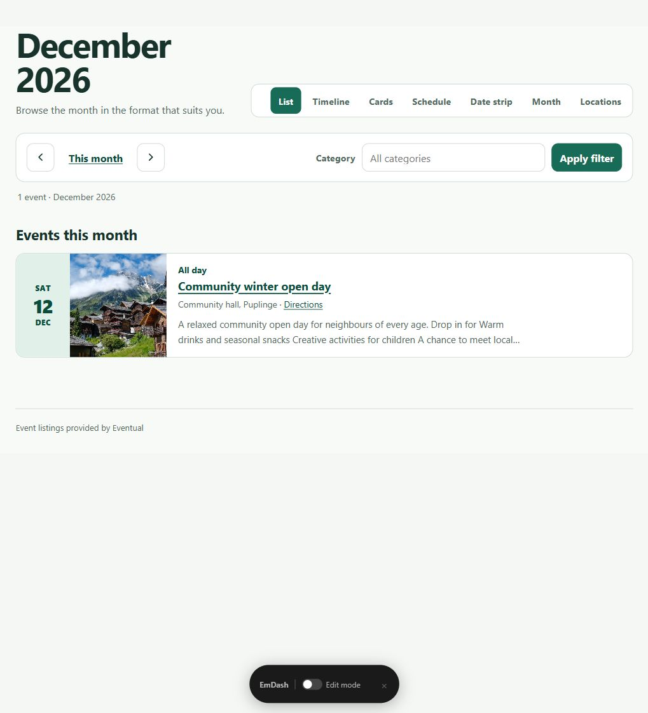
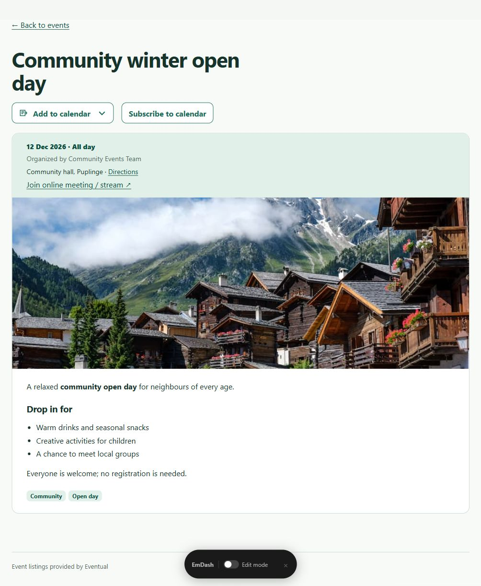

# Eventual Astro Event Browser Example

<p align="center">
  
</p>

An official, site-owned Astro frontend integration showcasing how to render events from [Eventual](https://github.com/Vermeulen-Solutions/eventual-emdash-sandbox).

This example demonstrates how an Astro website can consume Eventual's public JSON API to deliver **seven fast, responsive, and accessible visitor views** with zero client-side JavaScript.

---

## What It Looks Like

<p align="center">
  
</p>

### Included Views
Visitors can switch between seven viewing formats via query parameter (e.g., `/events?view=month`):

| View | Query Param | Description |
| :--- | :--- | :--- |
| **List** *(Default)* | `?view=list` | Chronological agenda list with high-contrast date blocks. |
| **Timeline** | `?view=timeline` | Vertical timeline with visual event nodes and summary cards. |
| **Card Grid** | `?view=cards` | Rich card grid displaying event cover images, organizers, and tags. |
| **Daily Schedule** | `?view=schedule` | Collapsible daily disclosures grouping events per date. |
| **Date Strip** | `?view=dates` | Horizontal date jump bar for quick navigation across the month. |
| **Month Calendar** | `?view=month` | Full week-aligned calendar grid on desktop; day-by-day agenda on mobile. |
| **Locations** | `?view=locations` | Events grouped by physical venue or virtual attendance with map directions. |

In addition, clicking any event opens a **shareable detail page** (`/events/[id]`) with:
- Schema.org JSON-LD structured data for search engines.
- Virtual meeting links (Zoom, Google Meet, YouTube Live) and map directions.
- "Add to Calendar" dropdown (Google Calendar, Outlook, Yahoo Calendar, and Apple `.ics` download).
- Feed subscription link for live calendar updates via `webcal://`.

---

## Quick Start

### Requirements
- Node.js `24` or newer
- An active EmDash site with the Eventual plugin installed (or test server)

### 1. Install & Configure
```sh
npm install
cp .env.example .env
```
*(On Windows PowerShell, use `Copy-Item .env.example .env`)*

In your `.env` file, point to your EmDash site:
```env
EVENTUAL_API_ORIGIN=http://127.0.0.1:4322
EVENTUAL_LOCALE=en-GB
EVENTUAL_DISPLAY_TIMEZONE=Europe/Amsterdam
```

### 2. Run Locally
```sh
npm run dev
```
Navigate to `http://localhost:4321/` in your browser. The root route automatically redirects to `/events`.

---

## How It Works

- **Zero-JavaScript by Default:** Everything—filtering, month navigation, view switching, and calendar disclosures—uses standard HTML links, GET forms, and native `<details>` elements. There are no client-side bundles or heavy calendar libraries.
- **Server-Side Rendered (SSR):** Built with Astro's `@astrojs/node` adapter in standalone mode. Every page request fetches the latest event data from EmDash, ensuring real-time accuracy without rebuilds.
- **Accessible & SEO Ready:** Includes semantic landmark regions, skip links, ARIA labels, polite screen reader announcements, and JSON-LD structured data in the document `<head>`.
- **Localization:** Supports multi-language labels (English, Dutch, French included) and locale-aware week layouts (Monday-first vs Sunday-first).
- **Native Multilingual Feeds (v0.12.0+):** Communicates with Eventual 0.12.0's native feeds via `locale` and `strict` query parameters. Uses `expandEventOccurrences` to expand occurrences across language siblings with localized titles, Portable Text, and fallback handling.


---

## Available Scripts

```sh
npm run check       # Run Astro diagnostics and TypeScript validation
npm test            # Run Vitest unit tests (calendar logic, timezone math, routes)
npm run test:page   # Build and verify rendered event HTML against a mock CMS
npm run build       # Build SSR server production bundle
npm run preview     # Preview built standalone server
```
